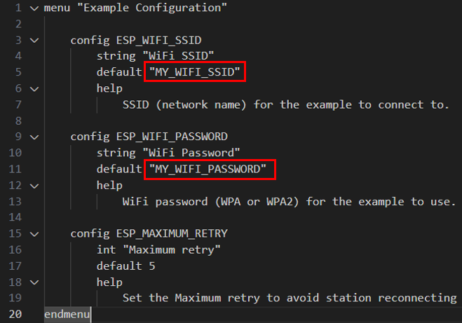
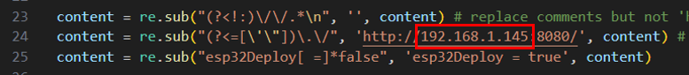
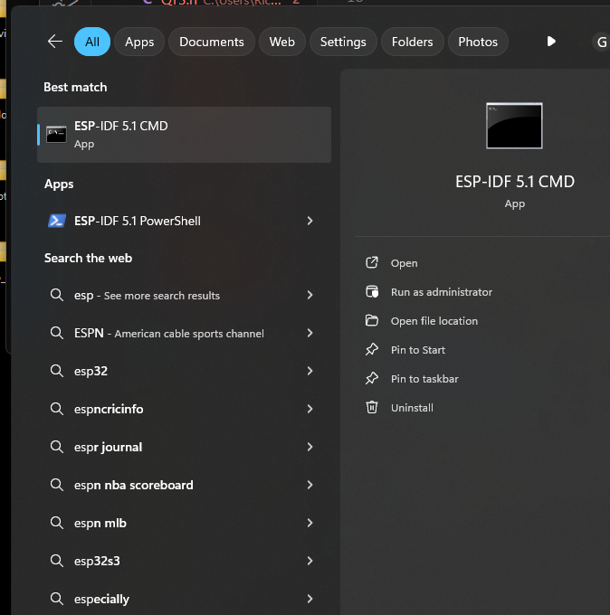
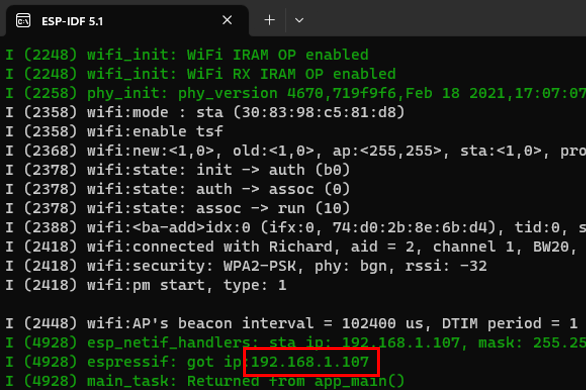

# QT3: A Humanoid Robot Arm
 
> Video : [QT3: A Humanoid Robot Arm with Armor](https://www.youtube.com/watch?v=ac9aGhzHxdw)
 
<p align="center">
 
 
</p>


## Brief

This project includes a robot arm and a dashboard. Warning: The codes are still not very optimized and are still a little bit messy and (potentially) buggy.

## Pre-requisites

Need to install live-server and esp-idf. To install esp-idf, see [this](https://docs.espressif.com/projects/esp-idf/en/stable/esp32/get-started/index.html). To install live-server, first open a powershell (in windows) , then type the following command:

```bash
npm install -g live-server
```
Test whether can start the server:
```bash
live-server
```
If cannot start, try open a powershell as administrator, run the following cmd, then run the above command again in another powershell.
```bash
Set-ExecutionPolicy Unrestricted
```

  
## Run Dashboard Without a Physical Robot
 
To run the dashboard without a physical robot, simply double click `Software/start_server.bat`. 

## Run Dashboard With a Physical Robot

To run the dashboard with a physical robot, first open `Firmware\esp32WifiWebpageServer\main\Kconfig.projbuild` and enter the wifi ssid and password of your router to ensure your esp32 can connect to it.

<p align="center">
  
</p>


Next, connect the esp32 of your robot to your PC, find the COM port of your esp32, modify the COM port in `run_esp32.bat`. Also, find the ip address of your PC (assume your PC is connected to the same router or in same local area network as the esp32), and enter the ip in `Utils\webpage2string.py` as shown below:

<p align="center">
  
</p>

 

Next open esp-idf, and navigate to the directory of this repo. 

<p align="center">
  
</p>

then run `run_esp32.bat` to flash the esp32 with the firmware and start the dashboard server:

```bash
run_esp32.bat
``` 

If successful, the ip address of the dashboard server will be displayed:

<p align="center">
  
</p>


To connect to the server, first disable CORS checking in Chrome by first pressing `Win + R`, then enter the following command. A chrome borwser will then be automatically opened.

```bash
chrome.exe --user-data-dir="C://Chrome dev session" --disable-web-security
``` 
 
Enter the ip address of the dashboard server (found above) in the chrome borwser.

